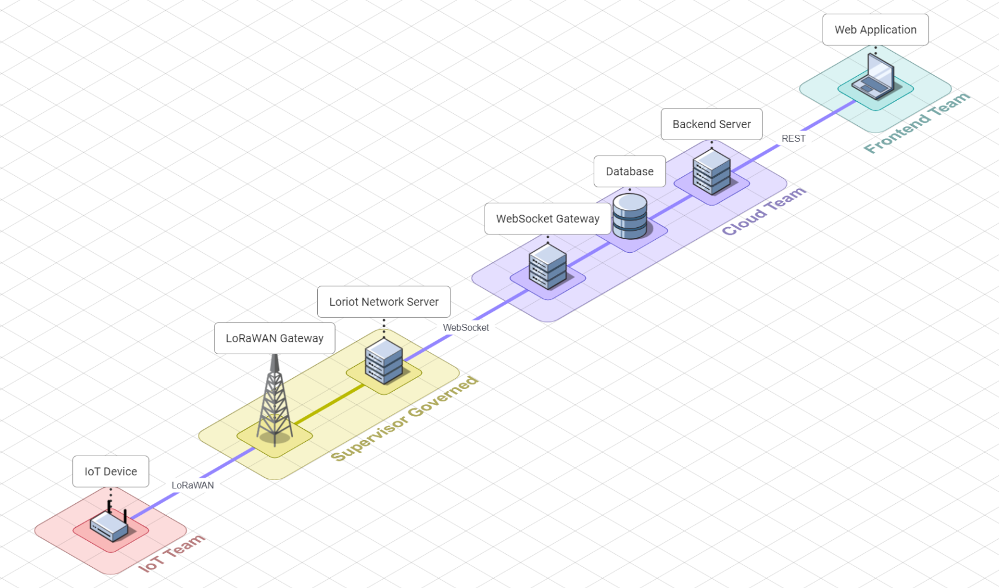
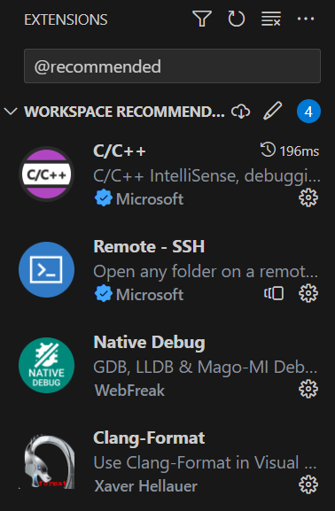
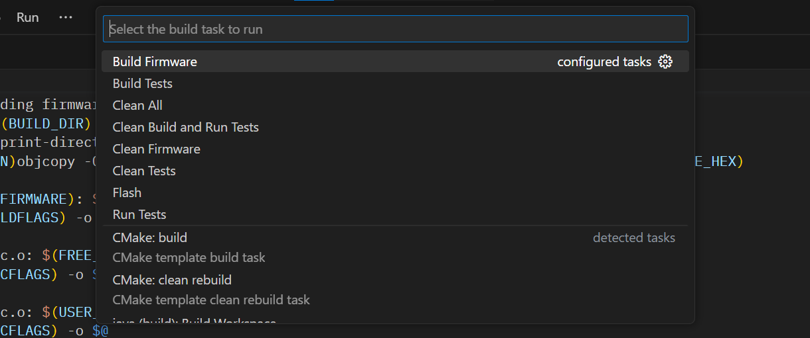

# Greenhouse IoT Device Firmware

# Introduction

Welcome to the README for the Greenhouse Environment Monitoring System! This project focuses on developing an Internet of Things (IoT) device firmware using FreeRTOS on the AVR2560 MCU platform. The purpose of this firmware is to control the greenhouse environment, ensuring optimal conditions for plant growth and cultivation.

The SEP4 Greenhouse Environment Monitoring System is a collaborative effort by three teams: frontend, backend, and iot. Each team plays a crucial role in the development and operation of the system, working together to create a seamless user experience and efficient control mechanisms.

### Repository Links

To access the repositories for the different components of the SEP4 Greenhouse Environment Monitoring System, please use the following links:

- [frontend](https://github.com/ham222/greenhouse-frontend) 
- [backend](https://github.com/xoxkoo/greenhouse-backend)
- [iot](https://github.com/wikcioo/greenhouse-iot)

### System Overview

# Development environment

Following section describes how to set up your own version of development environment for the project.

## Visual Studio Code

Solution has been designed with preference for Visual Studio Code as the environment for editing, building, flashing or testing, available for all platforms.

This results in particular set of functionalities that include (but are not limited to):

- **Recommended extensions:**\
  Set of extensions that are recommended projects will be suggested for installation on opening, if not installed.\
  

- **Tasks:**\
  Use `CTRL + Shift + B` to view and execute lifecycle methods.\
  

# Setup development environment on Windows

1. Install VirtualBox [here](https://www.virtualbox.org/wiki/Downloads)
2. Download Debian based Linux iso like [Ubuntu](https://ubuntu.com/download) or [Beryllium](https://www.bunsenlabs.org/installation.html)
3. Create and start a new virtual machine
4. Open a terminal
5. Run `sudo apt update && sudo apt upgrade` to get your system up-to-date
6. Run `sudo apt install linux-headers-$(uname -r) gcc make perl` to install required packages
7. In VirtualBox UI click Devices -> Insert Guest Additions CD image...
8. The previous step should have opened the new folder with mounted CD image; if not navigate to it in your file system
9. Open a terminal in that directory
10. Run `sudo sh ./VBoxLinuxAdditions.run`
11. Reboot
12. Attach USB Devices by clicking Devices -> USB -> device-name
13. Follow [this](#setup-development-environment-on-linux) guide to setup the development environment on Linux

# Remote SSH environment in Visual Studio Code

> Make sure that you have SSH access and are a member of the `dialout` group on the remote server.

1. Install Visual Studio Code [here](https://code.visualstudio.com/download).
2. Install the [Remote - SSH](https://marketplace.visualstudio.com/items?itemName=ms-vscode-remote.remote-ssh) extension from Microsoft.
3. Press the "Remote Explorer" icon, that is found on the sidebar.
4. Add new remote by pressing the add button next to SSH dropdown.
5. Enter `ssh user@domain` in the pop up prompt.
6. Enter the password.
7. Follow [this](#setup-development-environment-on-linux) guide to setup the development environment on Linux

# Setup development environment on Linux

1. Clone the project:\
   `git clone --recursive https://github.com/wikcioo/greenhouse-iot`
2. Change into cloned repository
3. Run `./configure.sh` to install required binaries and export LoRaWAN keys.

Setup is complete when the script is finished.

# Flashing

Alternatively to building the project yourself, you can flash one of the ready  available.

> Flashing requires configured environment

1. Download and extract latest release from GitHub.
2. Plug in both Atmel-ICE programmer and the device.
3. Run following to flash:\
   `avrdude -v -p m2560 -c atmelice -P usb -U flash:w:/path/to/firmware.hex:i`

# Reading from the device

For reading from the device, there are 2 recommendations:

- **WINDOWS**: Putty
- **LINUX**: Minicom

Make sure to set **baudrate** to **57600** and **implicit CR in every LF** to **true** (or **Add carriage return** for minicom).
